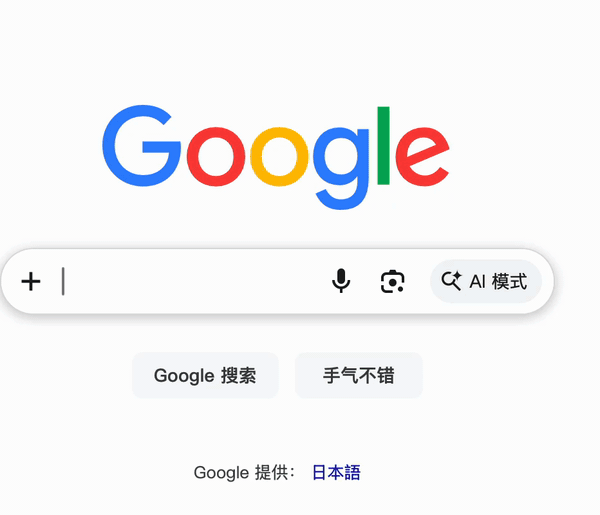

# Friday

**Local-first voice input for macOS.** Hold a key, speak, release — your words are
transcribed entirely on-device and pasted straight into whatever app you're using.

No cloud, no accounts, no audio ever leaves your Mac. Transcription runs locally
via [whisper.cpp](https://github.com/ggerganov/whisper.cpp).

<p align="center">
  
</p>

> Friday lives in your menu bar and stays out of the way until you hold the
> hotkey. It's built for people who think faster than they type and don't want
> to send their voice to someone else's server to do it.

## Features

- **Push-to-talk** — hold `Right Command` to record, release to transcribe.
- **Fully on-device** — transcription via `whisper.cpp`; audio never leaves your machine.
- **Paste anywhere** — text is inserted at your cursor, with clipboard restore afterward.
- **Secure-input aware** — automatically refuses to paste into password fields and other protected contexts.
- **Early mixed-language support** — handles dictation that mixes Chinese and English, with brand/tech-term biasing and cleanup. Rapid back-and-forth switching still has rough edges (see [Known Limitations](#known-limitations)).
- **First-run onboarding** — guided setup for permissions and model download.

## Requirements

- Apple Silicon Mac (macOS 13+)
- **Downloaded release builds need nothing extra** — the app bundles its own
  `whisper-server` and runtime libraries.
- **Building from source** also needs whisper.cpp's `whisper-server` on your
  `PATH` (e.g. `/opt/homebrew/bin/whisper-server`). Install it with:

```bash
bash scripts/setup-whisper.sh   # uses Homebrew (brew install whisper-cpp) if available
```

## Quick Start (from source)

```bash
swift build
swift run FridayMac
```

On first launch, grant the three permissions macOS requires for a voice-input tool:

1. **Microphone** — to capture your speech
2. **Accessibility** — to paste into other apps
3. **Input Monitoring** — to detect the push-to-talk hotkey

Then make sure the **Medium** model is installed, and try it: hold `Right Command`,
speak, release.

## Install as an App

Build, install, and launch `Friday.app` in one step:

```bash
bash scripts/install-local-app.sh
```

- Installs to `/Applications/Friday.app` (falls back to `~/Applications` if needed)
- Launchable by double-clicking in Finder
- Idempotent — cleanly replaces a previous install

Build the bundle only, without installing:

```bash
bash scripts/build-local-app.sh
# Output: dist/Friday.app
```

### Opening the Unsigned Preview Release

Current release zips are unsigned preview builds. On a clean Mac, macOS may show
"Apple could not verify Friday" and only offer **Done** or **Move to Trash**.
For a tester build:

1. Click **Done**.
2. Open **System Settings** -> **Privacy & Security**.
3. In **Security**, click **Open Anyway** for Friday.
4. Confirm **Open Anyway** again, then enter the administrator password.

This workaround is only for early tester builds. Public releases should move to
Developer ID signing and notarization before claiming normal double-click
installation.

## Models

- Two models are offered: **Medium** and **Turbo** (`large-v3-turbo`)
- **Turbo is recommended for mixed Chinese/English** — close to Large-v3 accuracy
  on code-switching but much faster (it keeps the full large encoder and only
  trims the decoder). Medium is lighter on memory.
- Models download to `~/Library/Application Support/Friday/models`
- Approximate download sizes: Medium ~1.5 GB; Turbo ~1.6 GB
- Voice-activity (VAD) segmentation is implemented but **disabled by default** in
  the current build while its quality is validated; the Silero VAD model is only
  downloaded if VAD is enabled (see [Known Limitations](#known-limitations), and
  [VAD_CHANGELOG.md](VAD_CHANGELOG.md) for the design history)

## Known Limitations

Friday is early software. A few things are intentionally honest about their
current state:

- **Mixed-language edge cases.** Typical Chinese/English dictation works well on
  Turbo, but because the whole recording is still decoded in a single pass with one
  auto-detected language, very rapid switching can occasionally drop a short
  segment. Tracked in [#4](https://github.com/FlyingFSR/friday/issues/4).
- **VAD is off by default.** Per-segment voice-activity detection is implemented
  end to end but disabled while its accuracy is validated, so the current path is
  a single-pass transcription of the whole recording.
- **Unsigned builds.** Release zips are not yet signed or notarized, so the first
  launch needs the **Privacy & Security** -> **Security** -> **Open Anyway** flow
  to get past Gatekeeper. Signed/notarized builds are planned.
- **Apple Silicon only.** macOS 13+ on Apple Silicon; there is no Intel build.
- **Two models: Medium and Turbo.** Turbo (`large-v3-turbo`) is recommended for
  mixed Chinese/English; Medium is lighter on memory. The older Large v3 option was
  removed in favor of Turbo, which is similarly accurate but much faster.

## Distributing a Signed Build

To install on another Mac without "unverified developer" warnings, use a
Developer ID signature + Apple notarization.

Store notary credentials once (saved in your Keychain):

```bash
FRIDAY_APPLE_ID="you@example.com" \
FRIDAY_TEAM_ID="ABCD123456" \
FRIDAY_APP_PASSWORD="xxxx-xxxx-xxxx-xxxx" \
bash scripts/store-notary-credentials.sh
```

Build a signed + notarized DMG:

```bash
FRIDAY_SIGN_IDENTITY="Developer ID Application: Your Name (ABCD123456)" \
FRIDAY_NOTARY_PROFILE="FridayNotary" \
bash scripts/release-signed-notarized-dmg.sh
# Output: dist/Friday.dmg
```

The recipient still grants microphone / accessibility / input-monitoring
permissions on first run — that's a macOS security requirement, not optional.

## Privacy

Friday is local-first by design. Your audio is transcribed on your own machine
and is never uploaded, logged remotely, or sent to any third party. Model files
are downloaded directly from their source the first time they're needed.

## Development

```bash
swift build          # build
swift test           # run tests
swift run FridayMac  # run
```

If the menu bar state ever looks stale, do a clean restart:

```bash
pkill -f FridayMac || true
swift build
.build/debug/FridayMac &
```

See [CONTRIBUTING.md](CONTRIBUTING.md) for how to get involved.

## Background

Friday started as a private macOS prototype for a very ordinary reason: I wanted
to dictate notes, prompts, and code-adjacent text without sending my voice to a
cloud service or changing the app I was already working in.

The public repository is young, but the project is not a one-day demo. Before
opening it up, Friday went through several months of daily-use iteration: the
menu bar app shell, hold-to-talk recording, paste-and-restore behavior,
permission onboarding, secure-input checks, local model management, mixed
Chinese/English cleanup, VAD experiments, and the move from a development-only
whisper setup to a bundled `whisper-server` release package.

That history is also why the README is intentionally specific about limitations.
Friday already works well enough to be useful, but it is still early public
software: unsigned preview releases, rough mixed-language edge cases, and some
keyboard-compatibility work remain.

It's open source because a local-first voice input tool is something people
should be able to inspect, adapt, and trust. Issues and pull requests are
welcome, especially from people testing it on real Macs and real dictation
workflows.

## License

[MIT](LICENSE) © Friday Mac contributors
